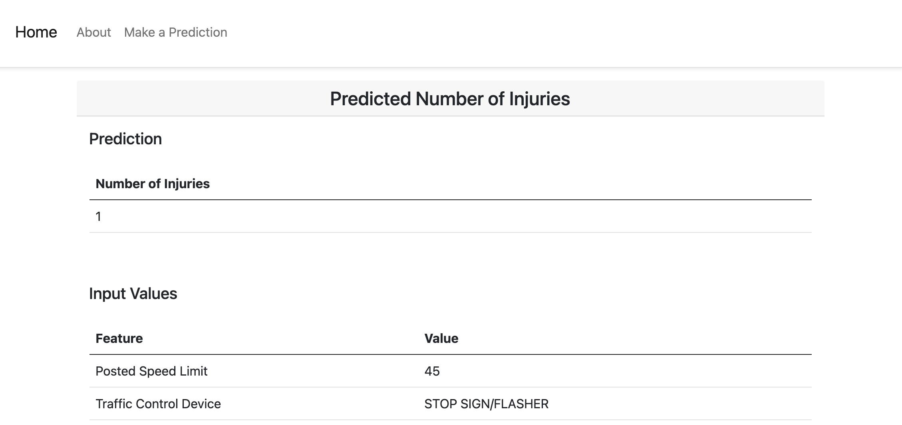

# Predicting the Number of Traffic Accident Injuries in Chicago

<p align="center">
  <a href="https://docs.google.com/presentation/d/1B-hyiECES9hVwE_pFt_3S2yOYE50hHYFjUbzlUWvU2Q/edit?usp=sharing">Presentation</a>
</p>

## Table of Contents
- [Background](#background)
- [Reproducing the Project](#reproducing-the-project)
- [Data](#data)
- [Exploratory Data Analysis](#exploratory-data-analysis)
- [Predictive Modeling](#predictive-modeling)
- [Results](#results)
- [Web App](#web-app)
- [Next Steps](#next-steps)

## Background
TBD

## Reproducing the Project
Install a local instance of [PostgreSQL](https://www.postgresql.org/download/) or use an existing instance. Create a database in the instance named `chi-traffic-accidents` and then run the [`create-raw-accident-tables.sql`](https://github.com/jkh-code/predicting-traffic-accident-injuries/blob/main/sql/create-raw-accident-tables.sql) script from the command line to add tables to the database.

Add the following environment variables to use the `make_postgres_conn()` and `make_alchemy_engine()` functions:

```sh
export PG_HOST="my host"
export PG_USER="my user"
export PG_PASSWORD="my password"
```

Add the following path to your Python paths to allow for importing the `make_postgres_conn()` and `make_alchemy_engine()` functions from the *src* folder.

```sh
export PYTHONPATH=$PYTHONPATH:$/my/path/to/predicting-traffic-accident-injuries/src/
```

## Data


## Exploratory Data Analysis


## Predictive Modeling


## Results


## Web App
Run the web app by inputting `python app/app.py` on the command line from the root folder of the project and then go to http://0.0.0.0:8080/ on your browser.

The home page provides a brief introduction to the project and provides links to start the prediction process or learn more about the project.


The *Accident Details* page allows the user to input details of the accident.


The *Predicted Number of Injuries* page provides a prediction and prints the input values below. Links at the bottom of the page allow for going back to the home page or starting a new prediction.



## Next Steps
- Examine the assumptions of linear regression to determine if the model can be used for inference.
- Conduct in-depth feature engineering.
- Add more features to the web app.
