# Predicting the Number of Injuries in Traffic Accidents

<p align="center">
  <a href="https://docs.google.com/presentation/d/1B-hyiECES9hVwE_pFt_3S2yOYE50hHYFjUbzlUWvU2Q/edit?usp=sharing target="_blank" rel="noopener noreferrer"">Presentation</a>
</p>

## Table of Contents
- [Background](#background)
- [Reproducing the Project](#reproducing-the-project)
- [Data](#data)
- [Exploratory Data Analysis](#exploratory-data-analysis)
- [Predictive Modeling](#predictive-modeling)
- [Results](#results)
- [Web App](#web-app)
- [Next Steps](#next-steps)


## Background
The purpose of this project is to produce a web app that emergency services can use to determine the number of people injured in a traffic accident. After knowing the number of people injured, emergency services can take the appropriate action. With this tool emergency services can better direct their limited resources.


## Reproducing the Project
Install a local instance of [PostgreSQL](https://www.postgresql.org/download/) or use an existing instance. Create a database in the instance named `chi-traffic-accidents` and then run the [`create-raw-accident-tables.sql`](https://github.com/jkh-code/predicting-traffic-accident-injuries/blob/main/sql/create-raw-accident-tables.sql) script from the command line to add tables to the database.

Add the following environment variables to use the `make_postgres_conn()` and `make_alchemy_engine()` functions:

```sh
export PG_HOST="my host"
export PG_USER="my user"
export PG_PASSWORD="my password"
```

Add the following path to your Python paths to allow for importing the `make_postgres_conn()` and `make_alchemy_engine()` functions from the *src* folder.

```sh
export PYTHONPATH=$PYTHONPATH:$/my/path/to/predicting-traffic-accident-injuries/src/
```


## Data
The main dataset for this project comes from the Chicago Data Portal's [Traffic Crashes - Crashes](https://data.cityofchicago.org/Transportation/Traffic-Crashes-Crashes/85ca-t3if) dataset. This dataset has 530k rows, 49 columns, and each row represents a single crash event. About half of the columns were not used for modeling purposes because they did not fit into the purpose of this project. A detailed discussion regarding why features were discarded is later in this section. Below, is a description of the fields used from this dataset.

| Field  | Description |
| ------------- | ------------- |
| crash_record_id | Unique ID for a specific crash incident. |
| posted_speed_limit | The posted speed limit where the accident occurred. |
| traffic_control_device | The kind of traffic control devices present. |
| device_condition | The condition of the traffic control devices present. |
| weather_condition | The weather at the time of the crash. |
| lighting_condition | The lighting at the time of the crash. |
| first_crash_type | The type of crash for the first impact involved in the incident. |
| trafficway_type | The type of trafficway where the accident occurred. |
| alignment | The alignment of the road where the accident occurred. |
| roadway_surface_cond | The condition of the roadway surface at the time of the crash. |
| road_defect | The kind of defects, if any, that existed on the road at the time of the crash. |
| street_direction | The orientation of the cars on the street where the accident occurred. |
| num_units | The number of units (cars, bikes, pedestrians, etc.) involved in the accident. |
| injuries_total | The number of injuries in an incident. |
| crash_hour | The hour of the crash. |
| crash_day | The day of the week of the crash. |
| crash_month | The month of the crash. |

The secondary dataset for this project comes from the Chicago Data Portal's [Traffic Crashes - People](https://data.cityofchicago.org/Transportation/Traffic-Crashes-People/u6pd-qa9d) dataset. This dataset has 1.17 million rows, 30 columns, and each row describes the people involved in each crash. The purpose of this dataset was to add additional data to the predictive model in order to improve model performance. The features examined in this project are below and a discussion about their impact on the model are given in the [Predictive Modeling](#predictive-modeling) section.

| Field  | Description |
| ------------- | ------------- |
| crash_record_id | Unique ID for a specific crash incident. |
| person_type | The person type for each person involved in the accident. Values could be driver, passenger, pedestrian, or bicyclist. |
| ejection | Indicates if a person in a vehicle was ejected or extricated from their vehicle. |

After reviewing the columns available in the Traffic Crashes - Crashes dataset, 30 features were dropped because they did not have an impact on the use case for this project, predicting number of injuries during the report of an accident to emergency services. The table below provides types of fields that were dropped, why they were dropped, and examples of those types of fields.

| Type of Field  | Examples | Reason Dropped |
| ------------- | ------------- | ------------- |
| ID fields | rd_no, crash_record_id, and person_id | Unique identifiers are used for joining related data but do not have predictive power. |
| Data collected after accident | photos_taken_i and statements_taken_i | Data collected after an accident does not fit with the use case of predicting the number of injuries at the time of the accident. |
| Data unrelated to injuries | report_type and date_police_notified | These fields are determined to have no impact on predicting the number of injuries. |
| Data too sparse to be predictive | street_no and street_name | These fields will appear too infrequently in the data to have any predictive power. |
| Injury type counts | injuries_reported_not_evident and injuries_non_incapacitating | The purpose of this project is to see if the total number of injuries can be predicted and then the model can be refined to include specific types of injury counts. |


## Exploratory Data Analysis
The purpose of this project will be to predict the number of injuries from accident data. However, at times for exploratory data analysis (EDA) purposes the data may be presented as categories of the number of injured for easier analysis. The goal of this EDA is to try and determine what factors may impact injuries existing in a crash.

From an initial review of the data, the first two plots reveal most accidents do not result in an injury and the third plot reveals of the crashes that result in an injury, most of those result in one injury. These characteristics of the data will impact modeling and how they are dealt with will be discussed in the [Predictive Modeling](#predictive-modeling) section.

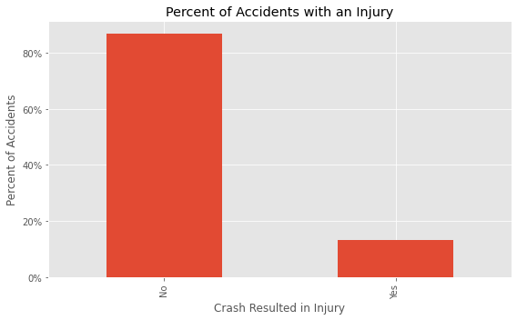


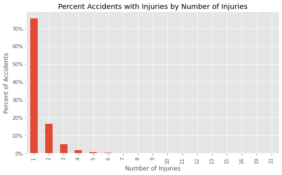

The speed limit may play a factor in the number of injuries, as the greater the average speed limit the more injuries there are; however, the change in average speed limit is not by much and may not be impactful.

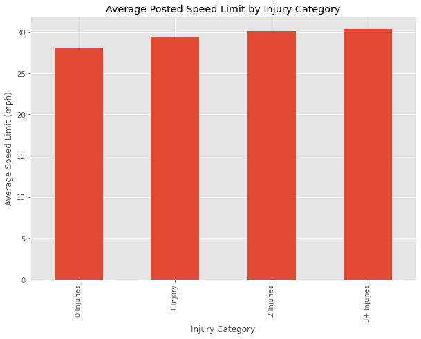

From the two density histograms below, the distribution of crashes without and with accidents have the same shape throughout the day but different magnitudes at different times. More non-injury crashes seem to happen between 9AM-2PM and more injury crashes seem to happen between 7PM-1AM.

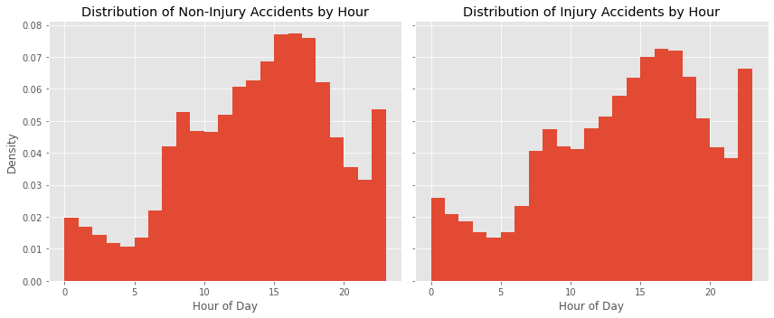

June and July seem to contribute to injury accidents; however, this may also be a result of more people driving during these months. Sunday and Saturday also seem to contribute to injury accidents; however, like with months, this may be a result of more people driving during these days.

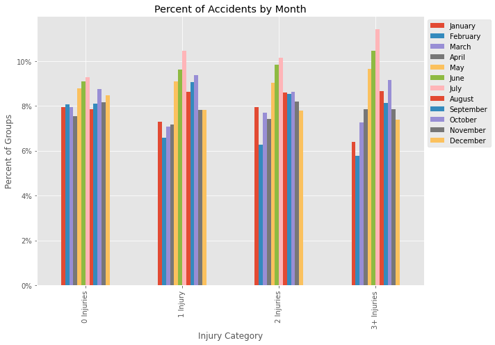

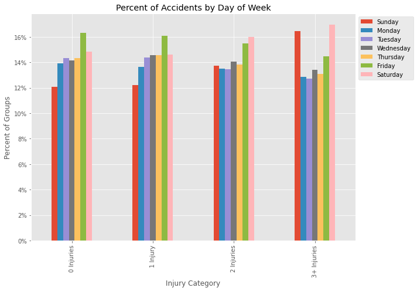

Road defect, road alignment, and roadway condition do not appear to have any impact on the number of injuries of accidents.

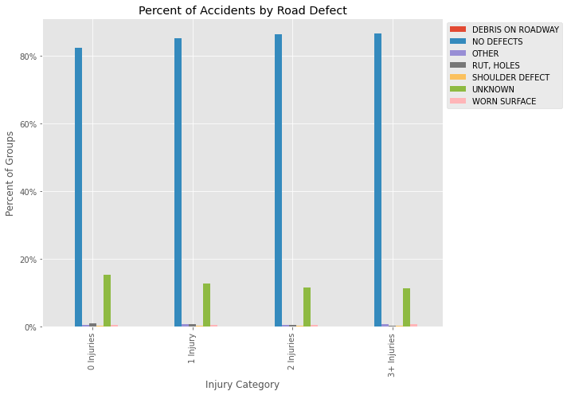

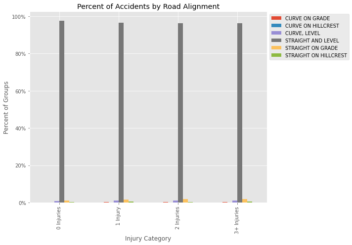

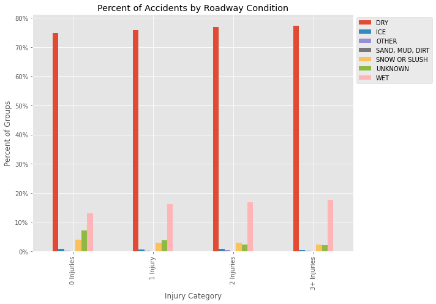

From the two plots below, the presence of traffic signals functioning properly may lead to higher injury accidents; however, this may be because locations where traffic intersects and drive at faster speeds are where traffic signals are placed.

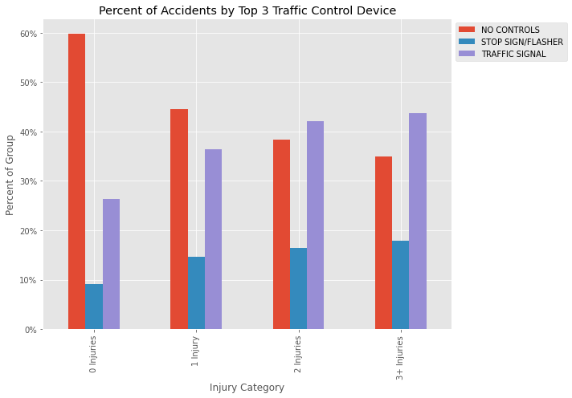

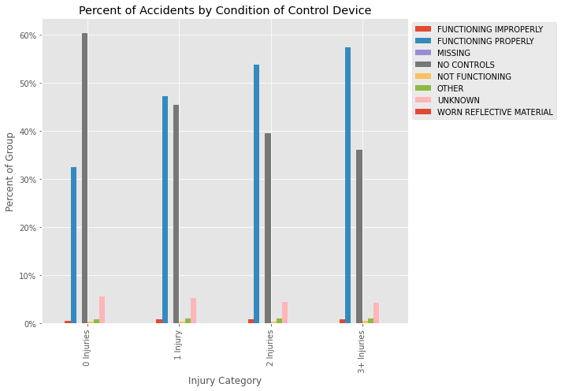

A higher frequency of injury accidents seem to occur on lighted roads at night.

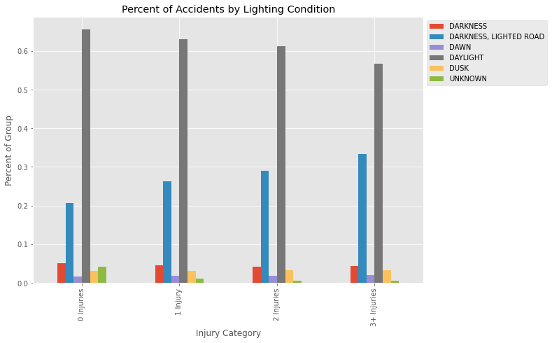

Accidents on roads oriented south may lead to accidents with higher numbers of injuries.

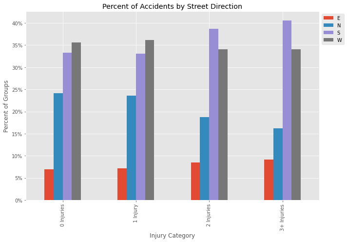


## Predictive Modeling
Linear regression, random forest regression, and gradient boosted regression will be the three models evaluated for their impact on predicting the number of injuries per crash. Root mean square error (RMSE) will be used to evaluate the effectiveness of each model because it provides a measure of how far off a model is on average. The closer RMSE is to zero, the better a model.

From the EDA, the majority of crashes have zero injuries and of the crashes that have injuries, over 75% of them have one injury. To deal with this imbalanced data two sets of models will be explored: lone regression models that are trained on the full set of data and a custom, ensemble model where the classifier model is trained on the full set of data and will classify an accident as having injuries or no injuries and the regression model is trained on accidents that have injuries and will return the number of injuries if the classifier models predicts injuries. The model with the best performance will be selected for refinement. Furthermore, before creating the ensemble model, the lone regression models will be trained on injury-only data to determine if building the full model is worthwhile.

The models will also be trained on two different sets of data. The first set of data will be data from the crashes dataset. The second set of data will be data from the crashes dataset joined with data from the peoples dataset. The model and data combination that returns the best performance will be used.


## Results
The table below contains the results from training the models. The row highlighted in bold contains the best performing models.

| Training Data | Dummy Model | Linear Reg. | Random Forest | Gradient Boosted Reg. |
| --- | --- | --- | --- | --- |
| **Injury/Non-injury data, no extra columns** | **0.5560** | **0.5153** | **0.5267** | **0.5107** |
| Injury/Non-injury data, extra columns| 0.5473 | 0.5153 | 0.5270 | 0.5111 |
| Injury-only data, no extra columns | 0.8363 | 0.7884 | 0.8077 | 0.7842 |
| Injury-only data, extra columns | 0.8243 | 0.7890 | 0.8056 | 0.7852 |

From the table above:
- The best performing set of models are from the dataset that contains injury and non-injury data and does not contain additional columns from the peoples dataset.
- Adding data from the peoples dataset either did not improve performance or it made performance worse.
- Training the regression models on injury-only data made the models perform worse. While this is not an indication the ensemble model will perform worse, the high RMSE of these regression models gives pause and given the limited amount of time to developed this project, the ensemble method will not be perused at this time.

To determine the best model, refer to the table below. While Gradient Boosted Regression has a better RMSE, the training time and prediction time for the linear regression model are lower. The difference in RMSE between the two models is also very close despite Gradient Boosted Regression performing slightly better. Therefore, the linear regression model is chose due to its lower prediction time and not that much different RMSE.

| Model | RMSE | Training Time (sec) | Prediction Time (sec) |
| --- | --- | --- | --- |
| Linear Regression | 0.5153 | 2.06 | 0.09 |
| Gradient Boosted Reg. | 0.5107 | 142 | 0.66 |

To optimise the linear regression model, a lasso linear model was trained with cross validation to determine the optimum model and the least important features for predicting. The performance of this model are given in the table below, and the plot below the table illustrates the optimum alpha on a plot of the betas versus alpha. The optimum alpha value disregards 40 features and retains 89 features from the transformed data.

| Model | alpha | RMSE | Prediction Time (sec) |
| --- | --- | --- | --- |
| Lasso Regression | 3.27e-5 | 0.5111 | 0.09 |

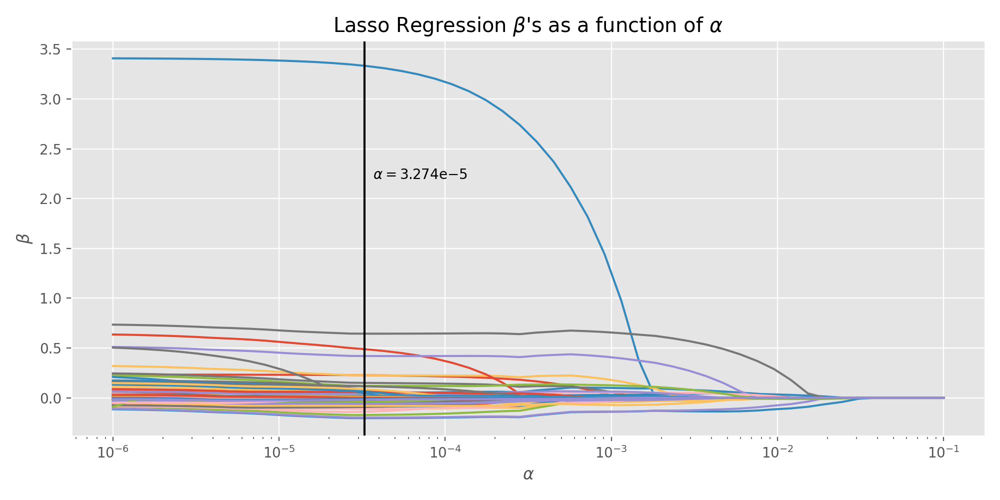

The lasso regression model slightly improves the RMSE and does not change the prediction time. For the web app, the lasso regression model will be implemented for predictions because of its slightly better RMSE.


## Web App
Run the web app by inputting `python app/app.py` on the command line from the root folder of the project and then go to http://0.0.0.0:8080/ on your browser.

The home page provides a brief introduction to the project and provides links to start the prediction process or learn more about the project.

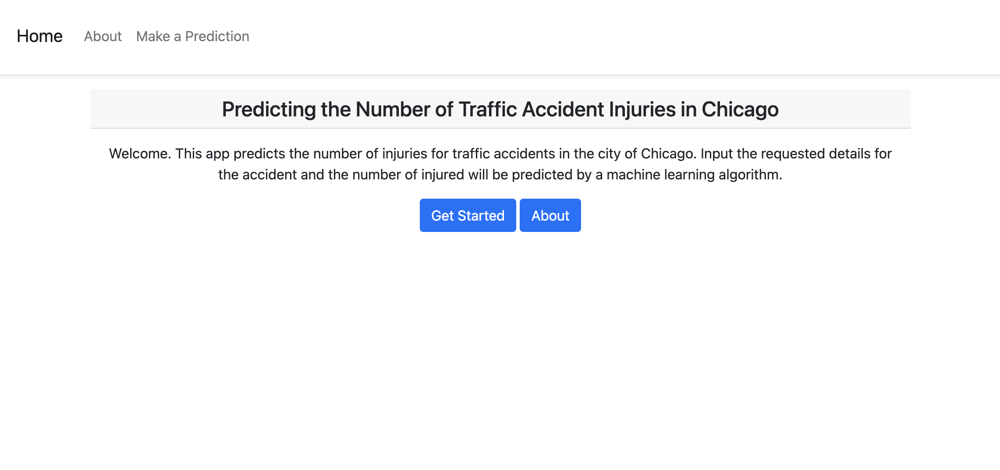

The *Accident Details* page allows the user to input details of the accident.


The *Predicted Number of Injuries* page provides a prediction and prints the input values below. Links at the bottom of the page allow for going back to the home page or starting a new prediction.


## Next Steps
- Examine the assumptions of linear regression to determine if the model can be used for inference.
- Conduct in-depth feature engineering.
- Build the full ensemble method to determine its true performance.
- Add more robust form validation than what is currently present in the web app.
