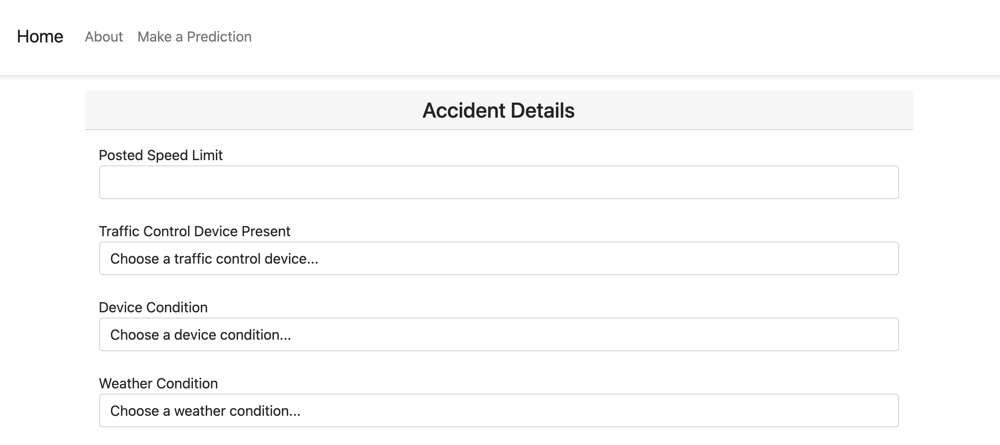

# Predicting the Number of Traffic Accident Injuries in Chicago

<p align="center">
  <a href="https://docs.google.com/presentation/d/1B-hyiECES9hVwE_pFt_3S2yOYE50hHYFjUbzlUWvU2Q/edit?usp=sharing">Presentation</a>
</p>

## Table of Contents
- [Background](#background)
- [Reproducing the Project](#reproducing-the-project)
- [Data](#data)
- [Exploratory Data Analysis](#exploratory-data-analysis)
- [Predictive Modeling](#predictive-modeling)
- [Results](#results)
- [Web App](#web-app)
- [Next Steps](#next-steps)

## Background
TBD

## Reproducing the Project
Install a local instance of [PostgreSQL](https://www.postgresql.org/download/) or use an existing instance. Create a database in the instance named `chi-traffic-accidents` and then run the [`create-raw-accident-tables.sql`](https://github.com/jkh-code/predicting-traffic-accident-injuries/blob/main/sql/create-raw-accident-tables.sql) script from the command line to add tables to the database.

Add the following environment variables to use the `make_postgres_conn()` and `make_alchemy_engine()` functions:

```sh
export PG_HOST="my host"
export PG_USER="my user"
export PG_PASSWORD="my password"
```

Add the following path to your Python paths to allow for importing the `make_postgres_conn()` and `make_alchemy_engine()` functions from the *src* folder.

```sh
export PYTHONPATH=$PYTHONPATH:$/my/path/to/predicting-traffic-accident-injuries/src/
```

## Data
The main dataset for this project comes from the Chicago Data Portal's [Traffic Crashes - Crashes](https://data.cityofchicago.org/Transportation/Traffic-Crashes-Crashes/85ca-t3if) dataset. This dataset has 530k rows, 49 columns, and each row represents a single crash event. About half of the columns were not used for modeling purposes because they did not fit into the purpose of this project. A detailed discussion regarding why features were discarded is later in this section. Below, is a description of the fields used from this dataset.

| Field  | Description |
| ------------- | ------------- |
| crash_record_id | Unique ID for a specific crash incident. |
| posted_speed_limit | The posted speed limit where the accident occurred. |
| traffic_control_device | The kind of traffic control devices present. |
| device_condition | The condition of the traffic control devices present. |
| weather_condition | The weather at the time of the crash. |
| lighting_condition | The lighting at the time of the crash. |
| first_crash_type | The type of crash for the first impact involved in the incident. |
| trafficway_type | The type of trafficway where the accident occurred. |
| alignment | The alignment of the road where the accident occurred. |
| roadway_surface_cond | The condition of the roadway surface at the time of the crash. |
| road_defect | The kind of defects, if any, that existed on the road at the time of the crash. |
| street_direction | The orientation of the cars on the street where the accident occurred. |
| num_units | The number of units (cars, bikes, pedestrians, etc.) involved in the accident. |
| injuries_total | The number of injuries in an incident. |
| crash_hour | The hour of the crash. |
| crash_day | The day of the week of the crash. |
| crash_month | The month of the crash. |

The secondary dataset for this project comes from the Chicago Data Portal's [Traffic Crashes - People](https://data.cityofchicago.org/Transportation/Traffic-Crashes-People/u6pd-qa9d) dataset. This dataset has 1.17 million rows, 30 columns, and each row describes the people involved in each crash. The purpose of this dataset was to add additional data to the predictive model in order to improve model performance. The features examined in this project are below and a discussion about their impact on the model are given in the [Predictive Modeling](#predictive-modeling) section.

| Field  | Description |
| ------------- | ------------- |
| crash_record_id | Unique ID for a specific crash incident. |
| person_type | The person type for each person involved in the accident. Values could be driver, passenger, pedestrian, or bicyclist. |
| ejection | Indicates if a person in a vehicle was ejected or extricated from their vehicle. |

After reviewing the columns available in the Traffic Crashes - Crashes dataset, 30 features were dropped because they did not have an impact on the use case for this project, predicting number of injuries during the report of an accident to emergency services. The table below provides types of fields that were dropped, why they were dropped, and examples of those types of fields.

| Type of Field  | Examples | Reason Dropped |
| ------------- | ------------- | ------------- |
| ID fields | rd_no, crash_record_id, and person_id | Unique identifiers are used for joining related data but do not have predictive power. |
| Data collected after accident | photos_taken_i and statements_taken_i | Data collected after an accident does not fit with the use case of predicting the number of injuries at the time of the accident. |
| Data unrelated to injuries | report_type and date_police_notified | These fields are determined to have no impact on predicting the number of injuries. |
| Data too sparse to be predictive | street_no and street_name | These fields will appear too infrequently in the data to have any predictive power. |
| Injury type counts | injuries_reported_not_evident and injuries_non_incapacitating | The purpose of this project is to see if the total number of injuries can be predicted and then the model can be refined to include specific types of injury counts. |

## Exploratory Data Analysis


## Predictive Modeling


## Results


## Web App
Run the web app by inputting `python app/app.py` on the command line from the root folder of the project and then go to http://0.0.0.0:8080/ on your browser.

The home page provides a brief introduction to the project and provides links to start the prediction process or learn more about the project.


The *Accident Details* page allows the user to input details of the accident.



The *Predicted Number of Injuries* page provides a prediction and prints the input values below. Links at the bottom of the page allow for going back to the home page or starting a new prediction.


## Next Steps
- Examine the assumptions of linear regression to determine if the model can be used for inference.
- Conduct in-depth feature engineering.
- Add more features to the web app.
